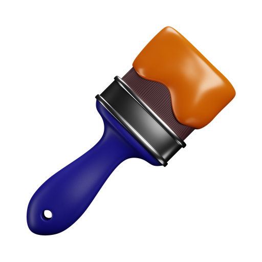
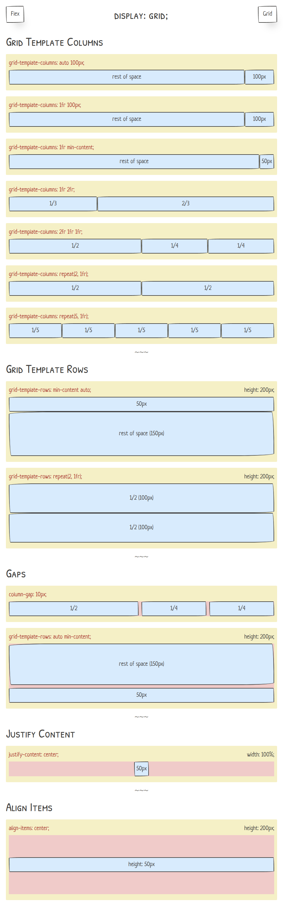

  
  <h2 align="center"><a href="https://css.namito.wiki">Demo</a></h2>
  
Webside for sharing my skills.

 

_This is a project designed for my personal use._

## Objective

The objective of this project is to demo how CSS Layouts work to other developers.

## Tools

-   Aurelia
-   RxJS
-   CSS Flexbox
-   CSS Grid

